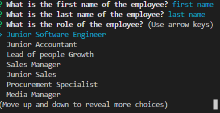

# Employee-Tracker-Management-System
A command line application that provide interfaces that are "Content management Systems (CMS)".  It manages a company's employee database, using Node.js, Inquirer, and MySQL. This application allows the user to perform CRUD action to the department, role, employee in the database.

## Table of Content

  - [Feature](#feature)
  - [Installation](#installation)
  - [Usage](#usage)
  - [Credits](#credits)
  - [License](#license)

## Feature

Perform CRUD actions to manage your company infrastructure relationship.

## Installation

Step 1: Clone the repo (HTTPS: `git clone https://github.com/louieiply/Employee-Tracker-Management-System.git` or SSH: `git@github.com:louieiply/Employee-Tracker-Management-System.git`)

Step 2: Install Node.js

Step 3: npm i (install all components from the package.json)

## Usage

### Video

Demonstration link [CLick me](https://youtu.be/RqYNreIsrqE)

### Screenshot

Firstly, you need to run "node main.js" to execute the application.

After you started to execute the application. A message will be shown.

View all departments

View all roles

View all employees

Add a new department

Add a role

Add an employee

A question will ask if the employee will be assigned to a manager

A manager list will be shown

Update an employee role

Firstly, you need to select a employee

Secondly, a job title list will be shown.

Exit application.

## Credits

Github, express.js(npm), nodemon(npm)

## License
[MIT License - Copyright (c) 2022 Louie Ip](./LICENSE)

